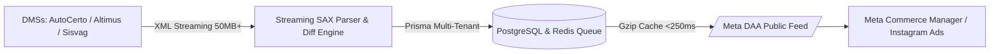

# 🚗 Pitch Deck: DriveSync (SaaS Auto Catálogo)
*A infraestrutura inteligente que transforma estoques de pátio em anúncios dinâmicos de alta conversão na Meta.*

---

## 🧭 Resumo Executivo (Elevator Pitch)
> **"Para concessionárias e revendas de seminovos que perdem milhares de reais em anúncios manuais e carros já vendidos, o DriveSync é a plataforma SaaS que conecta automaticamente os DMSs de pátio ao Meta Automotive Inventory Ads (DAA) em 3 minutos, reduzindo o Custo por Lead em até 38% e eliminando 100% do desperdício operacional."**

---

## 📑 Roteiro Slide a Slide (Padrão Sequoia / Y Combinator)

### Slide 1: Visão Geral & Capa
- **Título**: **DriveSync** — *Automotive Ads on Autopilot*
- **Subtítulo**: A ponte definitiva entre os gestores de estoque automotivo (DMS) e o Meta Automotive Ads (Instagram & Facebook).
- **Tagline**: Conecte seu pátio. Automatize suas vendas. Zero queima de verba.
- **Elementos Visuais**: Mockup do anúncio dinâmico em carrossel no Instagram com dados em tempo real (BMW 320i / Porsche Macan) com o selo *Live Feed Sync*.

---

### Slide 2: O Problema Real do Varejo Automotivo
*O marketing automotivo digital é quebrado por operações manuais e dados fragmentados.*

1. **Queima de Verba em Carros Vendidos**:
   - Concessionárias investem de R$ 5.000 a R$ 50.000+/mês em tráfego pago.
   - Um carro vendido no pátio continua rodando em anúncios pagos por até 48–72 horas.
   - **Resultado**: R$ 2.000 a R$ 5.000/mês jogados no lixo em cliques em veículos indisponíveis.
2. **Trabalho Manual Extenuante**:
   - Agências e equipes internas gastam mais de **40 horas/mês** subindo criativos estáticos, alterando preços e pausando anúncios manualmente.
3. **Leads Desqualificados & Frustrados**:
   - Leads chegam no WhatsApp procurando por carros que já foram vendidos ou com preços divergentes do sistema.
4. **Feeds de E-commerce Genéricos Não Funcionam**:
   - Carros exigem atributos específicos: quilometragem, ano de fabricação/modelo, placa/VIN, fotos 1:1, status de documentação e tipo de câmbio.

---

### Slide 3: A Solução — DriveSync
*Automação de ponta a ponta com homologação técnica com os DMSs líderes.*

- **Plug-and-Play em 3 Minutos**: O lojista apenas cola a URL do feed XML/JSON do seu DMS (AutoCerto, Altimus, Sisvag, BomControle, Webmotors) ou se autentica.
- **Normalização Canônica Instantânea**: Nosso motor traduz qualquer estrutura proprietária para o padrão rigoroso do **Meta Automotive Inventory Ads (DAA)**.
- **Sincronização Contínua (Sub-Hora / 15 min)**: Carro vendido no pátio? O anúncio é pausado ou removido do catálogo em tempo real.
- **Simulador Visual no Painel**: O lojista e a agência visualizam exatamente como o anúncio aparecerá no feed/stories do Instagram antes de veicular.

---

### Slide 4: Por que Agora? (Market Timing)
- **Migração do Tráfego Automotivo para Redes Sociais**: Mais de 78% dos compradores de seminovos pesquisam ativamente veículos no Instagram e Facebook antes de pisar na loja.
- **Maturidade do Meta DAA**: A Meta consolidou o formato automotivo dedicado (Dynamic Ads for Automotive), mas a barreira técnica de geração de XML XSD válido afasta 90% das lojas médias e pequenas.
- **Pressão por Eficiência Operacional**: Margens comprimidas no setor de seminovos exigem ROI rigoroso em mídia de performance.

---

### Slide 5: Demonstração do Produto & Experiência
- **Dashboard do Lojista (`frontend-app`)**:
  - Telemetria de estoque: total de veículos ativos, sincronizados e pendências.
  - Tabela de Pendências Inteligente: detecta veículos sem fotos, sem ano ou com erro de XSD antes de enviar à Meta.
  - Simulador de Anúncios Interativo (formato 1:1 com badge de status e CTA direto para WhatsApp).
  - Mapeador De/Para Interativo para feeds customizados.
- **Super Admin (`backoffice-app`)**:
  - Visão multi-tenant, logs de auditoria imutáveis, saúde de feeds parceiros e moderação de conteúdo.

---

### Slide 6: O Fosso Tecnológico (Tech Moat & Arquitetura)
*Construído para suportar volumes industriais de inventário com custo de infraestrutura quase nulo.*

- **Streaming SAX Parser**: Processa feeds pesados de 50MB+ (5.000 veículos) em `< 30 segundos` com uso de memória RAM `< 256MB`.
- **Motor de Diff Inteligente**: Detecta alterações incrementais de preço e status sem refazer ingestão desnecessária.
- **Edge Caching com Redis**: Entrega o feed público para o robô da Meta em `< 250ms (p50)`, garantindo 99.9% de SLA.
- **Inbound SEO Automatizado com IA (`ai-content-worker`)**: Pipeline proprietário (Google Gemini + LangGraph + Open Deep Research) que gera artigos técnicos sobre marketing automotivo, atraindo tráfego orgânico com CAC zero.

---

### Slide 7: Tamanho de Mercado (TAM / SAM / SOM)

- **TAM (Mercado Total Brasil & América Latina)**:
  - Brasil: **+45.000** concessionárias e revendas ativas de seminovos (Fonte: Fenabrave / Fenauto).
  - Mais de R$ 2,5 bilhões investidos anualmente em publicidade digital automotiva.
  - **TAM Estimado**: R$ 106 milhões/ano em software de integração de inventário.
- **SAM (Mercado Endereçável Disponível)**:
  - Revendas que já investem em tráfego pago digital e utilizam DMS compatível: **~22.000 revendas**.
  - **SAM Estimado**: R$ 52 milhões/ano.
- **SOM (Objetivo Inicial em 24 meses)**:
  - Capturar 4% do mercado ativo (concessionárias médias + revendas focadas em performance + carteiras de agências):
  - **900 lojas ativas** com ticket médio ponderado de R$ 210/mês:
  - **ARR Alvo (Ano 2)**: **R$ 2,26 Milhões** (MRR de ~R$ 189k).

---

### Slide 8: Modelo de Negócios & Unit Economics
*SaaS B2B puro, receita recorrente mensal e anual com alta margem de contribuição.*

| Plano | Preço Mensal | Foco / Segmento | Capacidade |
|---|---|---|---|
| **Starter Catalog** | **R$ 97/mês** | Lojas boutique e pátios compactos | Até 50 carros • 1 DMS • Sync diário |
| **Pro Automotive** *(Mais Popular)* | **R$ 197/mês** | Lojas de médio porte e concessionárias | Até 200 carros • Sync 15 min • Alertas WhatsApp |
| **Enterprise DAA** | **R$ 397/mês** | Grandes redes, grupos e agências de tráfego | Ilimitado • Multi-lojas • Sub-hora • Gerente Dedicado |

#### Indicadores Unit Economics Projetados:
- **Margem Bruta de Software**: **> 88%** (baixo custo de infraestrutura Node/Postgres/Redis).
- **LTV Esperado (Life Time Value)**: R$ 4.700 (retenção média estimada de 24 meses).
- **CAC Médio Esperado**: R$ 450 (mix de SEO orgânico com IA, parcerias com agências e indicação de DMSs).
- **LTV / CAC**: **10,4x** (altamente eficiente).

---

### Slide 9: Estratégia Go-To-Market (GTM)
1. **Canal 1 — Parcerias com Agências de Tráfego Automotivo (B2B2B)**:
   - Agências sofrem com o trabalho operacional de subir carros para dezenas de clientes.
   - Oferecer o DriveSync como white-label ou programa de parceiros com comissão recorrente (revenue share de 20%).
2. **Canal 2 — Homologação e Co-Marketing com DMSs**:
   - AutoCerto, Altimus, Sisvag e BomControle querem oferecer aos seus lojistas uma solução oficial para Meta Ads.
   - Integração listada no ecossistema de apps do DMS.
3. **Canal 3 — Product-Led Growth (PLG)**:
   - Teste grátis de 14 dias sem necessidade de cartão de crédito no plano Pro.
   - Onboarding guiado em 4 passos com validação imediata do XML.
4. **Canal 4 — Inbound Marketing Automatizado com IA**:
   - Artigos ultraespecíficos posicionando palavras-chave de cauda longa ("como fazer feed XML Meta Ads concessionária", "anúncio dinâmico autocerto").

---

### Slide 10: Cenário Competitivo & Vantagens Únicas

| Critério | Gestão Manual (Sem Ferramenta) | Ferramentas Genéricas de Feed (ex: Channable) | **DriveSync (SaaS Auto Catálogo)** |
|---|---|---|---|
| **Foco Automotivo** | ❌ Nenhum | ❌ Genérico para e-commerce (varejo) | ✅ **100% Especializado em Veículos** |
| **Integração com DMSs BR** | ❌ Não | ❌ Rara ou via regras complexas manuais | ✅ **Nativa com AutoCerto, Altimus, Sisvag, etc.** |
| **Validação de Erros XSD** | ❌ Erros só na Meta | ⚠️ Parcial | ✅ **Validador prévio em tempo real** |
| **Custo Mensal** | 💸 Custo de horas-homem (>R$ 1.500) | 💸 U$ 150 a U$ 500 (em dólar) | ✅ **A partir de R$ 97/mês em Real** |
| **Tempo de Setup** | ⏳ Semanas | ⏳ Horas / Dias | ✅ **< 3 minutos** |

---

### Slide 11: Roadmap & Próximos Passos
- **Q3/Q4 2026 (Fase Atual)**:
  - Conclusão do fluxo de onboarding automatizado com OAuth Meta.
  - Expansão de conectores para Webmotors Leads e Mercado Livre Motors.
- **Q1 2027**:
  - Suporte ao **Google Vehicle Ads (GVA)** (catálogo dinâmico na busca e Maps do Google).
  - App WhatsApp bot de telemetria (alertando quando um carro vendido teve anúncios pausados).
- **Q2 2027**:
  - Integração com TikTok Automotive Inventory Ads.
  - Internacionalização para México e Colômbia.

---

### Slide 12: A Proposta de Captação / Parceria (The Ask)
- **Objetivo da Rodada (Exemplo Pre-Seed / Seed)**: R$ 500.000 a R$ 1.200.000 para aceleração comercial.
- **Alocação de Recursos**:
  - **45% Vendas & Go-to-Market**: Time de inside sales focado em agências de tráfego e concessionárias + mídia de atração.
  - **35% Engenharia & Produto**: Integrações com novos DMSs e expansão para Google Vehicle Ads.
  - **20% Operações, Suporte & Parcerias de Ecossistema**.
- **Metas em 12 Meses**:
  - Atingir **450 clientes pagantes**.
  - Atingir **R$ 95.000 de MRR** (Break-even operacional).
  - Net Revenue Retention (NRR) > 105%.

---

## 🎯 Dicas de Apresentação (Pitching Tips)
1. **Comece pela dor financeira real**: Mostre quanto uma concessionária perde hoje rodando anúncio de carro que já foi vendido no sábado de manhã.
2. **Mostre o simulador visual**: Investidores adoram ver a UI com o mockup do Instagram em ação.
3. **Destaque a barreira técnica**: Não é apenas "um feed"; é um streaming parser de 50MB compatível com XSD estrito da Meta, algo que a maioria dos desenvolvedores não sabe construir com eficiência.
